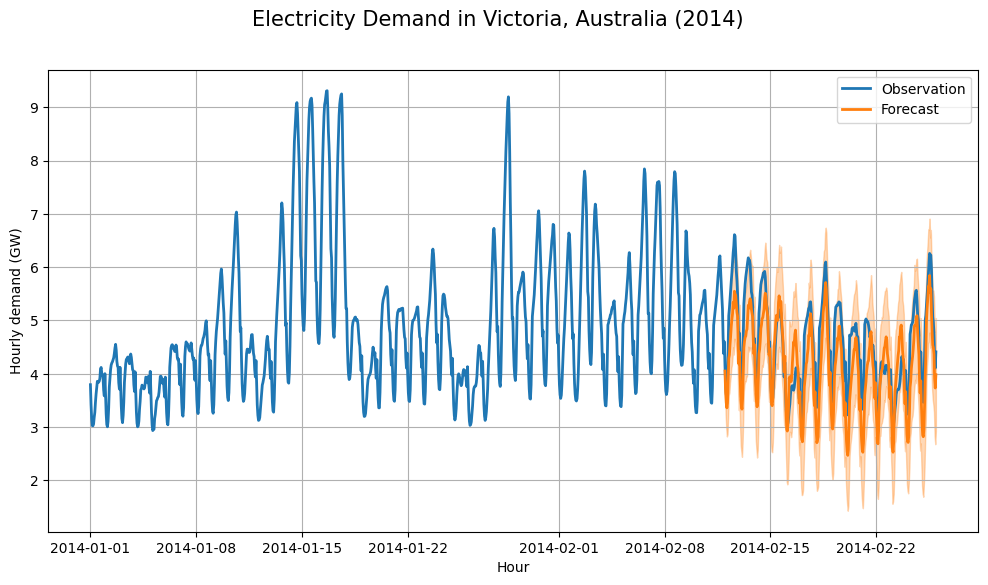
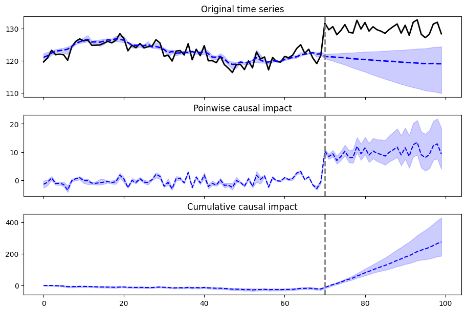

# sts-jax
Structural Time Series (STS) in JAX

This library has a similar to design to [tfp.sts](https://www.tensorflow.org/probability/api_docs/python/tfp/sts),
but is built entirely in JAX,
and uses the [Dynamax](https://github.com/probml/dynamax/tree/main/dynamax) library
for state-space models.
We also include an implementation of the
[causal impact](https://google.github.io/CausalImpact/) method.
This has a similar to design to [tfcausalimpact](https://github.com/WillianFuks/tfcausalimpact),
but is built entirely in JAX.

## Installation

To install the latest development branch:

``` {.console}
pip install git+https://github.com/probml/sts-jax
```
or use
``` {.console}
git clone git@github.com:probml/sts-jax.git
cd sts-jax
pip install -e .
```

## What are structural time series (STS) models?

The STS model is a linear state space model with a specific structure. In particular,
the latent state $z_t$ is a composition of states of all latent components:

$$z_t = [c_{1, t}, c_{2, t}, ...]$$

where $c_{i,t}$ is the state of latent component $c_i$ at time step $t$.

The STS model (with scalar Gaussian observations) takes the form:

$$y_t = H_t z_t + u_t + \epsilon_t, \qquad  \epsilon_t \sim \mathcal{N}(0, \sigma^2_t)$$

$$z_{t+1} = F_t z_t + R_t \eta_t, \qquad \eta_t \sim \mathcal{N}(0, Q_t)$$

where

* $y_t$: observation (emission) at time $t$.
* $\sigma^2_t$: variance of the observation noise.
* $H_t$: emission matrix, which sums up the contributions of all latent components.
* $u_t = x_t^T \beta$: regression component from external inputs.
* $F_t$: fixed transition matrix of the latent dynamics.
* $R_t$: the selection matrix, which is a subset of columns of base vector $e_i$, converting
    the non-singular covariance matrix into the (possibly singular) covariance matrix of
    the latent state $z_t$.
* $Q_t$: non-singular covariance matrix of the latent state, so the dimension of $Q_t$
        can be smaller than the dimension of $z_t$.

The covariance matrix of the latent dynamics model takes the form $R Q R^T$, where $Q$ is
a non-singular matrix (block diagonal), and $R$ is the selecting matrix.

More information of STS models can be found in these books:

> -   \"Machine Learning: Advanced Topics\", K. Murphy, MIT Press 2023.
>     Available at <https://probml.github.io/pml-book/book2.html>.
> -   \"Time Series Analysis by State Space Methods (2nd edn)\", James Durbin, Siem Jan Koopman,
>     Oxford University Press, 2012.

## Usage

In this library, an STS model is constructed by providing the observed time series and specifying a list of
components and the distribution family of the observation. This library implements
common STS components including **local linear trend** component, **seasonal** component, 
**cycle** component, **autoregressive** component, and **regression** component.
The observed time series can follow either the **Gaussian**
distribution or the **Poisson** distribution. (Other likelihood functions can also be added.)

Internally, the STS model is converted to the corresponding state space model (SSM) and inference
and learning of parameters are performed on the SSM.
If the observation $Y_t$ follows a Gaussian distribution, the inference of latent variables
$Z_{1:T}$ (gven the parameters) is based on the 
[Kalman filter](https://github.com/probml/dynamax/tree/main/dynamax/linear_gaussian_ssm).
Alternatively, if the observation $Y_t$ follows Poisson distribution, with
a mean given by $E[Y_t|Z_t] = e^{H_t Z_t + u_t}$, the inference of the
latent variables $Z_{1:t}$ is based on a generalization of the extended
Kalman filter, which we call the
[conditional moment Gaussian filter](https://github.com/probml/dynamax/tree/main/dynamax/generalized_gaussian_ssm),
based on [Tronarp 2018](https://acris.aalto.fi/ws/portalfiles/portal/17669270/cm_parapub.pdf).

The marginal likelihood of $Y_{1:T}$ conditioned on parameters can be evaluated as a 
byproduct of the forwards filtering process.
This can then be used to learn  the parameters of the STS model,
using  **MLE** (based on SGD implemented in the library [optax](https://github.com/deepmind/optax)),
**ADVI** (using a Gaussian posterior approximation on the unconstrained parameter space),
or **HMC** (from the library [blackjax](https://github.com/blackjax-devs/blackjax)).
The parameter estimation is done offline, given one or more historical timeseries.
These parameters can then be used for forecasting the future.

Below we illustrate the API applied to some example datasets.

## Electricity demand

This example is adapted from the [TFP blog](https://blog.tensorflow.org/2019/03/structural-time-series-modeling-in.html).
See [this file](./sts_jax/structural_time_series/demos/sts_electric_demo.ipynb) for a runnable version
of this demo.

The problem of interest is to forecast electricity demand in Victoria, Australia.
The dataset contains hourly record of electricity demand and temperature measurements 
from the first 8 weeks of 2014.  The following plot is the training
set of the data, which contains measurements in the first 6 weeks.

<p align="center">

<p>

We now build a model where the demand linearly depends on the temperature,
but also has two seasonal components, and an auto-regressive component.

```python
import sts_jax.structural_time_series.sts_model as sts

hour_of_day_effect = sts.SeasonalDummy(num_seasons=24,
                                       name='hour_of_day_effect')
day_of_week_effect = sts.SeasonalTrig(num_seasons=7, num_steps_per_season=24,
                                      name='day_of_week_effect')
temperature_effect = sts.LinearRegression(dim_covariates=1, add_bias=True,
                                          name='temperature_effect')
autoregress_effect = sts.Autoregressive(order=1,
                                        name='autoregress_effect')

# The STS model is constructed by providing the observed time series,
# specifying a list of components and the distribution family of the observations.
model = sts.StructuralTimeSeries(
    [hour_of_day_effect, day_of_week_effect, temperature_effect, autoregress_effect],
    obs_time_series,
    obs_distribution='Gaussian',
    covariates=temperature_training_data)

```
In this case, we choose to fit the model using MLE.

```python
# Perform the MLE estimation of parameters via SGD implemented in dynamax library.
opt_param, _losses = model.fit_mle(obs_time_series,
                                   covariates=temperature_training_data,
                                   num_steps=2000)
```

We can now plug in the parameters and the future inputs,
and use ancestral sampling from the
filtered posterior to forecast future observations.

```python
# The 'forecast' method samples the future means and future observations from the
# predictive distribution, conditioned on the parameters of the model. 
forecast_means, forecasts = model.forecast(opt_param,
                                           obs_time_series,
                                           num_forecast_steps,
                                           past_covariates=temperature_training_data,
                                           forecast_covariates=temperature_predict_data)
```

The following plot shows the mean and 95\% probability interval  of the forecast.
<p align="center">

<p>

## CO2 levels 

This example is adapted from the [TFP blog](https://blog.tensorflow.org/2019/03/structural-time-series-modeling-in.html).
See [this file](./sts_jax/structural_time_series/demos/sts_co2_demo.ipynb) for a runnable version
of the demo, which is similar to the electricity example.

## Time series with Poisson observations

We can also fit STS models with discrete observations following the Poisson 
distribution. Internally, the inference of the latent states $Z_{1:T}$ in the corresponding SSM
is based on the (generalized) extended Kalman filter implemented
in the library dynamax. An STS model for a Poisson-distributed time series can be constructed
simply by specifying observation distribution to be 'Poisson'. Everything else is the same
as the Gaussian case.

Below we  create a synthetic dataset, following [this TFP example](https://www.tensorflow.org/probability/examples/STS_approximate_inference_for_models_with_non_Gaussian_observations).
See [this file](./sts_jax/structural_time_series/demos/sts_poisson_demo.ipynb) for a runnable version
of this demo.


```python
import sts_jax.structural_time_series.sts_model as sts

# This example uses a synthetic dataset and the STS model contains only a
# local linear trend component.
trend = sts.LocalLinearTrend()
model = sts.StructuralTimeSeries([trend],
                                 obs_distribution='Poisson',
                                 obs_time_series=counts_training)

# Fit the model using HMC algorithm
param_samples, _log_probs = model.fit_hmc(num_samples=200,
                                          obs_time_series=counts_training)

# Forecast into the future given samples of parameters returned by the HMC algorithm.
forecasts = model.forecast(param_samples, obs_time_series, num_forecast_steps)[1]
```
<p align="center">

<p>

### Comparison to TFP

The TFP approach to STS with non-conjugate likelihoods is to perform
HMC on the joint distribution of the latent states $Z_{1:T}$ and the parameters, conditioned 
on the observations $Y_{1:T}$. Since the dimension of the state space grows linearly
with the length of the time series to be fitted, the implementation will be inefficient
when $T$ is relatively large.  By contrast, we (approximately) marginalize out $Z_{1:T}$,
using a generalized extended Kalman filter,
and just perform HMC in the collapsed parameter space. This is much faster, but yields
comparable error, as we show below. (The burnin steps of HMC in the TFP-STS
implementation is adjusted such that the forecast error of the two implementations
are comparable.)

<p align="center">

<p>

## Causal Impact

The [causal impact](https://google.github.io/CausalImpact/CausalImpact.html)
method is implemented on top of the STS-JAX package.

Below we show an example, where Y is the output time series and X is a parallel 
set of input covariates. We notice a sudden change in the response variable at time $t=70$,
caused by some kind of intervention (e.g., launching an ad campaign).
We define the causal impact of this intervention
to be the change in the observed output compared to what we would have
expected had the intervention not happened.
See [this file](./sts_jax/causal_impact/causal_impact_demo.ipynb)
for a runnable version of this demo.
(See also the [CausalPy](https://www.pymc-labs.io/blog-posts/causalpy-a-new-package-for-bayesian-causal-inference-for-quasi-experiments/)
package for some related methods.)

<p align="center">

<p>

This is how we run inference:

```python
from sts_jax.causal_impact.causal_impact import causal_impact

# The causal impact is inferred by providing the target time series and covariates,
# specifying the intervention time and the distribution family of the observation.
# If the STS model is not given, an STS model with only a local linear trend component
# in addition to the regression component is constructed by default internally.
impact = causal_impact(obs_time_series,
                       intervention_timepoint,
                       'Gaussian',
                       covariates,
                       sts_model=None)

```


The format of the output from our
causal impact code follows that of the R package
[CausalImpact](https://google.github.io/CausalImpact/CausalImpact.html),
and is shown below.

```python
impact.plot()
```

<p align="center">

<p>

```python
impact.print_summary()

Posterior inference of the causal impact:

                               Average            Cumulative     
Actual                          129.93             3897.88       

Prediction (s.d.)           120.01 (2.04)      3600.42 (61.31)   
95% CI                     [114.82, 123.07]   [3444.72, 3692.09] 

Absolute effect (s.d.)       9.92 (2.04)        297.45 (61.31)   
95% CI                      [6.86, 15.11]      [205.78, 453.16]  

Relative effect (s.d.)      8.29% (1.89%)       8.29% (1.89%)    
95% CI                     [5.57%, 13.16%]     [5.57%, 13.16%]   

Posterior tail-area probability p: 0.0050
Posterior prob of a causal effect: 99.50%
```


## About

Authors: [Xinlong Xi](https://www.stat.ubc.ca/users/xinglong-li),
[Kevin Murphy](https://www.cs.ubc.ca/~murphyk/).

MIT License. 2022
